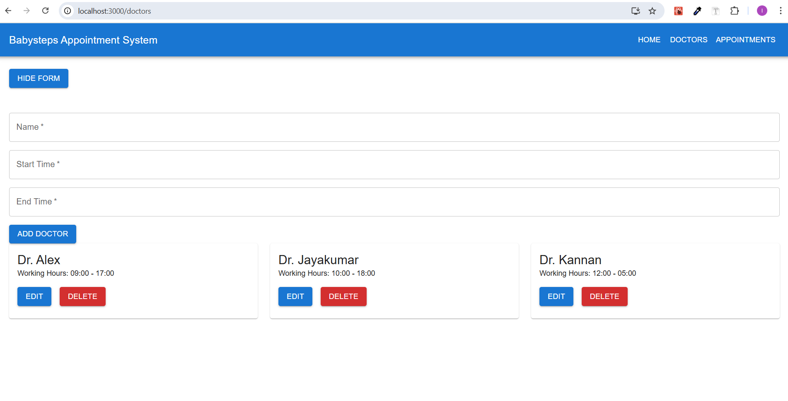
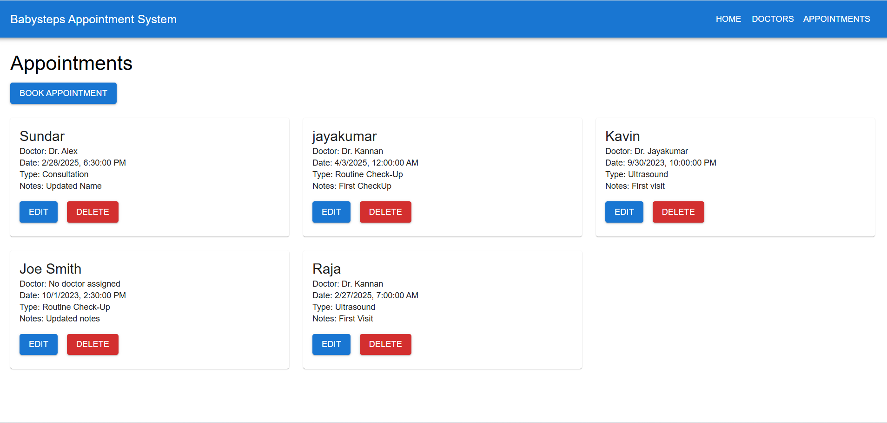
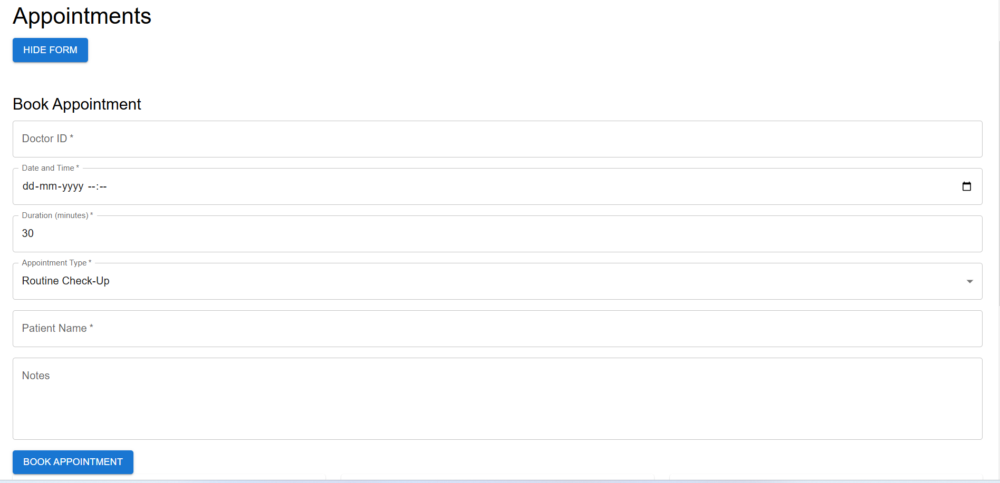

# Babysteps Appointment System

A full-stack web application for managing doctor appointments in a prenatal care service. Built with **Node.js/Express** for the backend, **MongoDB** for the database, and **React.js** for the frontend.

---

## Features

- **Doctors Management**:
  - Add, update, and delete doctors.
  - View a list of all doctors.
- **Appointments Management**:
  - Book, update, and delete appointments.
  - View a list of all appointments.
- **User-Friendly Interface**:
  - Intuitive and responsive UI built with **Material-UI**.

---

## Technologies Used

### Backend
- **Node.js**: JavaScript runtime for building the backend.
- **Express.js**: Web framework for Node.js.
- **MongoDB**: NoSQL database for storing data.
- **Mongoose**: MongoDB object modeling for Node.js.

### Frontend
- **React.js**: JavaScript library for building the user interface.
- **Material-UI**: UI component library for React.
- **Axios**: HTTP client for making API requests.
- **React Router**: Routing library for React.

---

## Installation

### Prerequisites
- **Node.js**: Install from [nodejs.org](https://nodejs.org/).
- **MongoDB**: Install from [mongodb.com](https://www.mongodb.com/try/download/community).

### Steps

1. **Clone the Repository**:
   ```bash
   git clone https://github.com/your-username/babysteps-appointment.git
   cd babysteps-appointment


## API EndPoints

## Doctors

GET /doctors: Retrieve a list of all doctors.
POST /doctors: Add a new doctor.
PUT /doctors/:id : Update a doctor's details.
DELETE /doctors/:id : Delete a doctor.


## Appointments

GET /appointments: Retrieve a list of all appointments.
POST /appointments: Book a new appointment.
PUT /appointments/:id : Update an appointment.
DELETE /appointments/:id : Cancel an appointment.

### Folder Structure

           Backend/

models/            # MongoDB models
routes/            # API routes
controllers/       # Route handlers
config/            # Database configuration
erver.js          # Backend entry point


            frontend/

public/            # Static assets
src/
    components/    # React components
    pages/         # React pages
    App.js         # Main application component
    index.js       # Frontend entry point
    styles.css     # Global styles
    package.json   # Frontend dependencies


## Navigate to the backend folder:

cd backend.

## Install dependencies:

npm install.

## Start the backend server:

node server.js

The backend will run on http://localhost:5000

## Set Up the Frontend:

Navigate to the frontend folder:

cd ../frontend.

## Install dependencies:

npm install.

## Start the frontend development server:

npm start.

The frontend will run on http://localhost:3000.

## Output Screenshots

## Home page 

## Add Doctor page 

## Book Appoinment page

